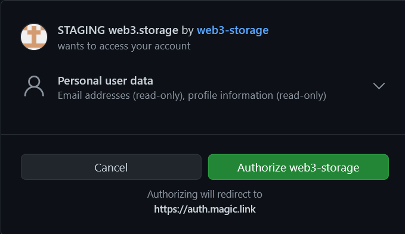

# Better storage. Better transfers. Better internet.

> All you need to use Web3.Storage is an API token and some data — no need to wrangle with the complicated and obstructive details of data storage. Get up and running fast with this simple [quickstart guide](#quickstart).

Most data on the internet is stored with one of the large data storage companies. While companies like Amazon, Google, and Microsoft make is fairly easy for developer to store their application data, their services come with a whole host of terms and restrictions about what data can be stored, when it can be access, and who actually _owns_ that data! Not to mention, these services can be incredibly expensive, and cause developers to rack up huge bills without even knowing!

So instead of paying for restrictive and expensive data storage sevices, developers can store their data with _decentralized_ storage services. However, for the most part, these decentralizsed storage services are difficult to manage, and make data storage significantly more complicated. Most decentralized storage services need you to compile your data into a specific format, find a storage provider to host your data, buy some cryptocurrency to pay the storage provider, and _then_ send your data across the internet. This is where Web3.Storage comes in!

All you need to use Web3.Storage is an API token and some data. Web3.Storage hides the complicated and obstructive parts of data-storage so that you, the developer, can get on with building what you want! Take a look at the [quickstart guide below to get started ↓](#quickstart)

## Quickstart

Get up and running quickly by following these simple steps! We're going to sign up to Web3.Storage, get an API token, create a script to upload a file, and then view that file in the browser.

### Create an account

You need an account to get an API token and manage your stored data. You can sign up **for free** using your email address or GitHub.

::::tabs
:::tab Email

#### Use your email

1. Go to [web3.storage/login](https://web3.storage/login)
1. Enter your email address.
1. Verify your email address by clicking the **Log in** button in your email inbox.
1. You're all set!

:::

:::tab GitHub

#### Use GitHub

1. Click **GitHub** on the Login screen
1. Authorize web3-storage when asked by GitHub.

    

1. You're all set!

:::
::::

Next up, [getting an API token ↓](#get-an-api-key)

### Get an API token

Next, let's create an API token. You'll need an API token to interact with Web3.Storage using the JavaScript client library:

1. Go to your [Profile page](https://web3.storage/profile) and click **API Tokens** → **New Token**.
1. Enter a descriptive name for this token:
1. Click **Create**.
1. Make a note of the **Key**. Click **Copy** to copy the API token to your clipboard.

    :::warning Keep your API token private
    Do not share your API token with anyone else. This key is specific to your account.
    :::

Next up, [uploading a file to Web3.Storage ↓](#upload-a-file)

### Grab Web3.Storage client project

1. Create a folder for your Quickstart project and move into it:

    ```shell
    mkdir web3-storage-quickstart
    cd web3-storage-quickstart
    ```

1. Create a file called `put-files.js` and paste in the following code:

    <<< @/code-snippets/quickstart/put-files.js

1. Create another file called `package.json` and paste in the following code:

    <<< @/code-snippets/quickstart/package-example.json

1. Save both files, and then run `npm install` from your project folder:

    ```shell
    npm install
    ```

1. Run the script by calling `node put-files.js` and supplying your token using the `--token` option:

    ```shell
    node put-files.js --token<YOUR_TOKEN>
    ```

    This command will output something like:

    ```shell
    Content added with CID: bafybeiezmummmxc3xclgsnhbkz2vh42cakbccyvatqqdw6hz2tvt74pd3i
    ```

1. Make a note of the CID `bafyb...`. We'll need it in the next section.

Next up, we'll look at how to [get and view your data from Web3.Storage ↓](#view-file)

### View your file

Viewing your files is simple and can be done using a browser gateway:

1. Go to `gateway.web3.storage/YOUR_FILES_CID`, replacing `YOUR_FILES_CID` with the CID you get from uploading your file.
1. You should be able to see your file in the browser!

## Next steps

Congratulations, you've just covered the basics of Web3.Storage! Take a look at the [reference API section](/reference) for more details on what else you can do with this service.
