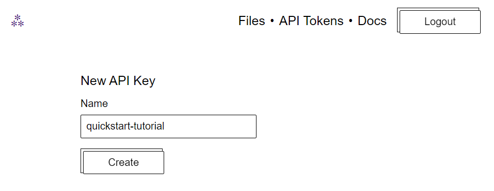

# Quick start

The decentralized web is complicated, but it doesn't have to be! In this quick start guide, we're going to sign up for a Web3.Storage account, create an API, upload a file, and then view that file.

## Create an account

You need an account to get an API key and manage your stored data. You can sign up using your email address, or GitHub Sign up is free:

::::tabs

::: tab First Tab
Here's an example of using tabs to organize content.
::: 

::: tab Second Tab
Another tab!
:::
::::

### Use your email

1. Go to [web3.storage/login](https://web3.storage/login)
1. Enter your email address.
1. Verify your email address by clicking the **Log in** button in your email inbox.
1. You're all set!

### Use GitHub 

If you'd prefer, you can sign up to Web3.Storage using your GitHub account. Just click **GitHub** on the Login screen and then authorize web3-storage when asked by GitHub.


Once you've done this you can head on to [getting an API key ↓](#get-an-api-key)

Next up, [getting an API key ↓](#get-an-api-key)

## Get an API key

Now that you've got your account set up, you can create an API key. You'll need an API key to interact with Web3.Storage using the JavaScript client library:

1. Go to the [tokens page](https://web3.storage/tokens) by clicking **API Tokens** → **New Token**.
1. Enter a descriptive name for this token:

    

1. Click **Create**.
1. Make a note of the **Key**. Click **Copy** to copy the API key to your clipboard.

:::warning Keep your API key private
Do not share your API key with anyone else. This key is specific to your account.
:::

Next up, [uploading a file to Web3.Storage ↓](#upload-a-file)

## Grab Web3.Storage client project

At some poit in the future the Web3.Storage client will be hosted on NPM. Until then, we need to clone the `web3-storage-client` repository and build the client library.

1. Clone the `web3-storage/web3-storage-client` repository from GitHub:

    ```shell
    git clone --depth=1 https://github.com/web3-storage/web3.storage.git
    ```

    The `--depth=1` option tells Git that we only want the latest updates instead of the entire version history for the project.

1. Move into the `web3.storage` folder and install the NPM dependencies:

    ```shell
    cd web3.storage
    npm install
    ```

1. Move to the `/packages/client/examples/node.js` folder and install the dependencies for _this_ example:

    ```shell
    cd packages/client/examples/node.js
    npm install
    ```

1. Run the script by calling `node put-files.js` and supplying your token using the `--token` option:

    ```shell
    node put-files.js --token<YOUR_TOKEN>
    ```

    This command will output something like:

    ```shell
    Content added with CID: bafybeiezmummmxc3xclgsnhbkz2vh42cakbccyvatqqdw6hz2tvt74pd3i
    ```

1. Make a note of the CID `bafyb...`. We'll need it in the next section.

Next up, we'll look at how to [get and view your data from Web3.Storage ↓](#view-file)

## View your file

Viewing your files is simple, and can be done using a browser gateway:

1. Go to `gateway.web3.storage/YOUR_FILES_CID`, replacing `YOUR_FILES_CID` with the CID you get from uploading your file.
1. You should be able to see your file in the browser!

## Next steps

Congratulations, you've just covered the basics of Web3.Storage! Take a look at the [reference API section](/reference) for more details on what else you can do with this service.
